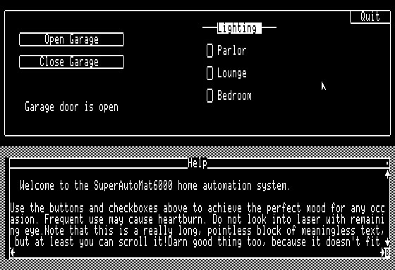
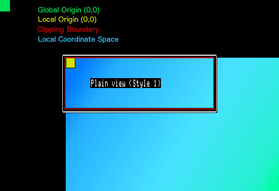
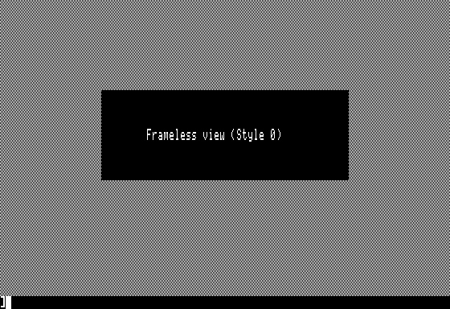
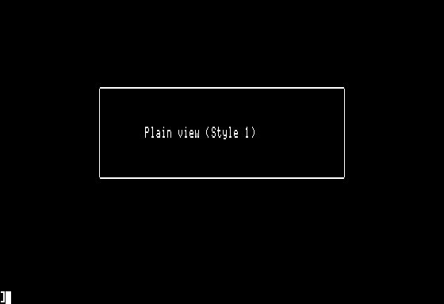
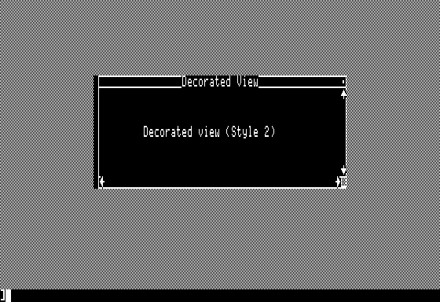
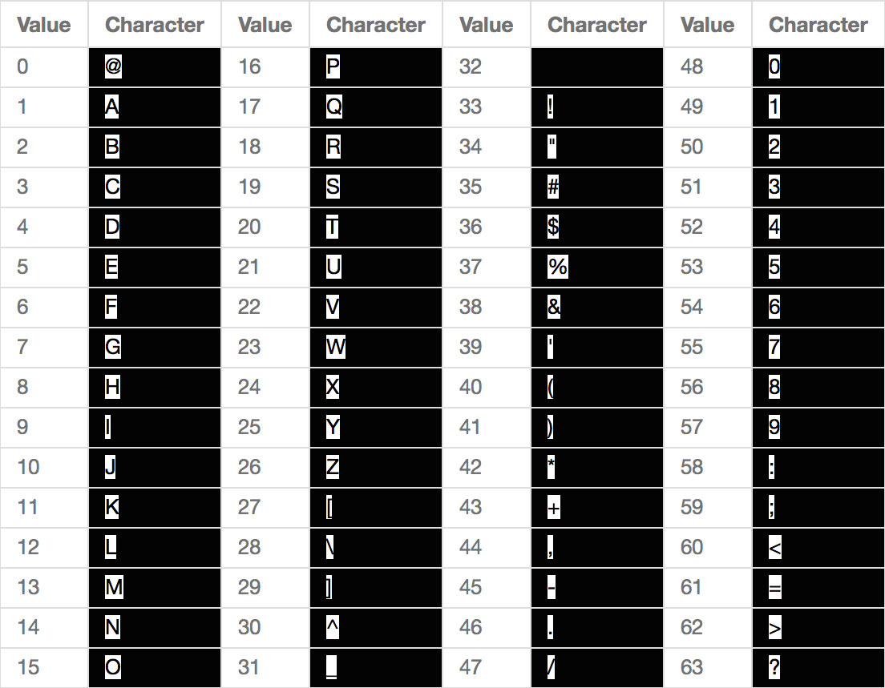
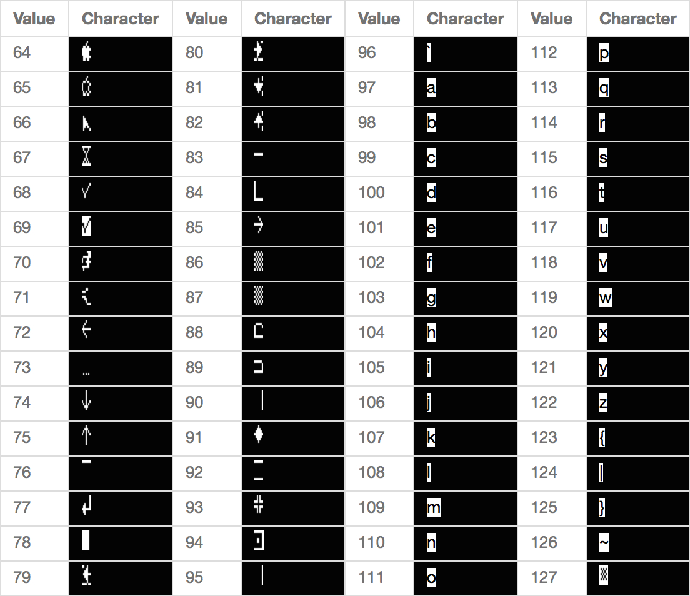
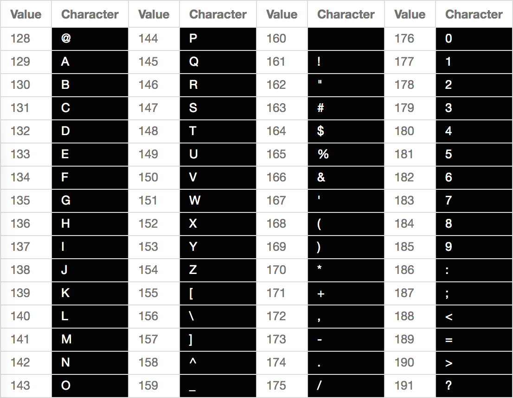
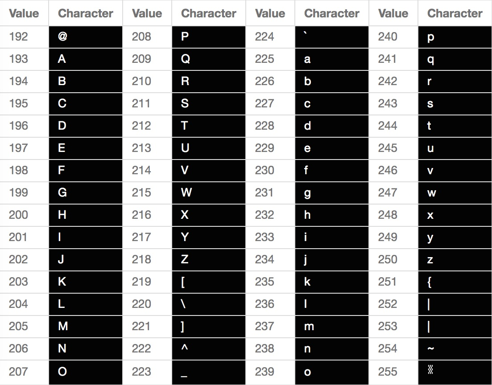

WeeGUI
======

WeeGUI is a lightweight library for creating graphical user interfaces in 80 column text mode on the Apple IIe Enhanced, Apple IIc, and Apple IIgs families of computers. It supports both keyboard and mouse controls for your interface. It is designed to take minimal RAM (less than 7k), and can be used from assembly language or Applesoft BASIC programs under ProDOS. WeeGUI installs itself on the secondary hi-res page, using an area normally vacant in most text-based BASIC and assembly programs.

You can use WeeGUI as a full-blown user interface system, or as a simple drawing library for ASCII art. Use as much or as little of its features as you wish. WeeGUI tries not to enforce any particular structure or use-case on your program. It is intended to be so easy to use that you'll choose it over rolling your own menuing system for whatever application you're building. Whether you're building the next ProTERM, or just a quick-and-dirty interface for your Arduino project, WeeGUI can be your go-to library.

 

Demo
----

For a quick demo of what WeeGUI can do, install the disk image *weegui.dsk* in your emulator, or make a floppy disk from it and boot your real Apple II. On the disk, you'll find the WeeGUI library itself, an Applesoft demo program, and an assembly language demo program. Boot the disk, then try the following command:

	]-basicdemo
	
	
You'll be presented with a sample GUI for a fictional home automation system. This entire interface, including mouse and keyboard control, is just a handful of lines of Applesoft. You can navigate this demo using Tab and Return, or using your mouse. Mouse support works in the Virtual II emulator as well (assuming you have a mouse card assigned to one of the slots). If you have a physical Apple II, you can use either a standard Apple IIc mouse, an Apple IIe mouse with a mouse card in any slot, or the standard ADB mouse on your Apple IIgs.

 

Next, try this assembly language demo:

	]-asmdemo
	
Since assembly is all about speed, this demo shows off some fast ASCII-art animation done with WeeGUI. Hit 'q' (lowercase) to quit the demo.

The source code of these two example programs can be found in Appendix C of this document.

 
	
Installation
------------

####Applesoft

Place the WeeGUI library in the same ProDOS folder as your program. Then, at the top of your program, simply load it into memory as follows:

	10  PRINT  CHR$ (4)"BRUN WEEGUI"

That's it! WeeGUI will load itself into memory and it's ready for use.

####Assembly Language

When using assembly language, you can install WeeGUI by loading the *WEEGUI* library into memory from your program. The simplest way to do this is to invoke BRUN using the Applesoft input buffer, like this:

		ldx #0
		ldy #0
	@0:	lda brunCmdLine,x
		beq @1
		sta $0200,y
		inx
		iny
		bra @0
	@1:	jsr $be03

	brunCmdLine:
		.byte "BRUN WEEGUI",$8d,0
		

If you load the library some other way, make sure you load it at the base address specified in the memory map below, and perform a JSR to that address in order to prepare the library for use.
		
You also need to include the file *WeeGUI_MLI.s* in your program. This is the WeeGUI Machine Language Interface, and it provides all the constants, entry points, etc that you'll need for WeeGUI.

####Memory Map

WeeGUI is about 7k in size, and lives on top of the second hires page. The assumption is that, if you're making an 80-column-text-based GUI program, you don't _also_ need fancy hi-res page flipping animations. For an experimental version that lives primarily in the auxiliary memory bank, see Appendix A.

<table align="center">
<tr><td>$FFFF</td><td></td></tr>
<tr><td></td><td>...</td></tr>
<tr><td>$9600-$BFFF</td><td>ProDOS</td></tr>
<tr><td>$5BC5-$95FF</td><td>Applesoft Program Space</td></tr>
<tr><td>$4000-$5BC4</td><td>WeeGUI</td></tr>
<tr><td>$3FFF</td><td>End of Hi-Res Page 1</td></tr>
<tr><td></td><td>...</td></tr>
<tr><td>$0000</td><td></td></tr>
</table>

 

Calling WeeGUI
--------------

###Applesoft

WeeGUI is accessed from Applesoft through ampersand extensions. For example, the HOME command clears the screen and can optionally draw a desktop background:

	10 &HOME(1)

If the call requires parameters, you can make a C-style function call. For example, to select view #6, you would call:

	10 &SEL(6)
	
The exact name of each API call is specified in the Applesoft portion of the API documentation below.

Also note that you can call WeeGUI interactively from the Applesoft prompt. No line numbers required! This is a great way to experiment with the API calls. Some calls may leave the cursor in an odd location, but you can still get the gist of things.

###Assembly Language

*Note:* All assembly language samples are written in the style of the **ca65** assembler (which is also what WeeGUI is written in). However, the code is easily adaptable to your assembler of choice.

From assembly, a Machine Language Interface is provided, similar to ProDOS. WeeGUI is called by setting a function name in the X register, and calling the WeeGUI entry point. For example:

	main:
		ldx #WGDesktop
		jsr WeeGUI

The constant *WGDesktop* is provided to your program by the *WeeGUI_MLI.s* file (part of the WeeGUI package). Be sure to include this file in your assembly language project. If a call requires parameters, these will be passed in a couple of ways, as shown below.

#####Register Passing:

Simple calls may use a register or two for parameters. For example, the call to select a view uses the accumulator (as specified in the API documentation):

	lda #6				; This is our parameter
	ldx #WGSelectView	; Followed by a typical WeeGUI call
	jsr WeeGUI

Registers that you use to pass a parameter to WeeGUI may contain different values upon return.

#####Zero Page Passing:

For more complex calls, there are 4 reserved parameter-passing locations in the zeropage. These are named PARAM0-PARAM3, and are specified in *WeeGUI_MLI.s*. These locations are unused by Applesoft or ProDOS. You can use them in your own programs, so long as they aren't disrupted while inside a WeeGUI call.

For example, the call to create a view uses the zero page to pass a pointer (as specified in the API documentation):

	lda #<addr			; 'addr' is a 16-bit pointer we'd like to pass in
	sta PARAM0			; PARAMn are reserved zeropage locations
	lda #>addr
	sta PARAM1
	ldx #WGCreateView	; Now we can make our typical WeeGUI call
	jsr WeeGUI
		
See the section *Callbacks*, below, for more information on how 16-bit values are passed in to WeeGUI.

 

	
Program Structure for WeeGUI
----------------------------

Graphical user interfaces generally have a concept of a *run loop*. This is important because the program flow is driven asynchronously by the user's actions. Compare this to command-line programs, which enforce flow with specific moments of being blocked waiting for input. Most GUI libraries impose this run loop structure on your program. WeeGUI does not. Rather, it provides tools for you to set up a run loop if you wish, or you may simply call into WeeGUI in whatever way is most useful for your program. However, for a properly structured GUI program, you should build a run loop using the techniques described below.

###Assembly Language

A typical assembly language run loop simply waits for keypresses and responds to them.

	runLoop:
		lda $C000
		bpl runLoop
		sta $C010

		; Respond to keys as needed

		bra runLoop

If you want to support the mouse, WeeGUI has you covered. You just need to add one piece to your run loop:

	runLoop:
		ldx #WGPendingViewAction
		jsr WeeGUI

		lda $C000
		bpl runLoop
		sta $C010

		; Respond to keys as needed

		bra runLoop

Note the call to *WGPendingViewAction* on each pass through the loop. For the mouse, WeeGUI will make note of actions taken by the user, but won't act until you say so. It is up to your program to call *WGPendingViewAction* periodically to allow WeeGUI to handle these events.

WeeGUI calls are relatively free of side effects. Most calls will clobber the BASL and BASH values in the zeropage (typically used by text rendering in Applesoft and other programs). Unless otherwise noted, all registers except parameters passed in can be assumed to be preserved by all API calls, and the system can be assumed to be in the same state you left it when you made the WeeGUI call.

The API documentation below indicates which registers and/or PARAM locations are used for parameter passing in each call, and what the value of the X register should be (in terms of constants supplied by *WeeGUI_MLI.s*)

###Applesoft

Normally, Applesoft is not intended to be used in a run-loop style of programming. To use a run-loop, there needs to be a non-blocking form of user-input. WeeGUI provides this for you with the &GET function. Calling &GET will retrieve keyboard input if any is pending, and store it in the variable you provide. If no keypresses are pending, execution proceeds to the next line.

Similar to the Assembly Language run loop, your Applesoft program also needs to allow WeeGUI to process mouse events that the user is creating outside your program's control. This is done with the &PDACT (pending action) function.

Here's a sample Applesoft run loop using these techniques:

	1  PRINT  CHR$ (4)"brun weegui"
	70 REM Run Loop
	80  &PDACT
	90  &GET(A%)
	99 REM 113 is the ASCII code for 'q' (to quit)
	100  IF A% = 113 THEN GOTO 1000
	110  GOTO 80
	1000 &EXIT

You can omit &PDACT if you have no desire to support the mouse.

Callbacks
---------

User interface elements (such as buttons and checkboxes) can have an *action callback* attached to them. This is a piece of your code that is called by WeeGUI any time that interface element needs to take action. This may occur when the user clicks with the mouse, or when they hit a hotkey on the keyboard, for example.

In Applesoft, callbacks are simply a line-number. WeeGUI will perform a GOSUB to the line number you provide, and expects it to end with a RETURN.

In assembly language, callbacks are a 16-bit address (a function pointer, of sorts) that you provide. WeeGUI will perform a JSR to the address you provide, and it is expected that your callback will end with an RTS. 16-bit pointers are always provided with the least significant byte first, just like any other 16-bit value on the Apple II.

Mouse Control
-------------

Adding mouse support to your WeeGUI program is very easy. The mouse is enabled and disabled using API calls. Once enabled, the mouse is processed automatically for you (including rendering the pointer as needed). When the user clicks on an interactive GUI element, WeeGUI will invoke a callback in your program, using the methods detailed above, under *Callbacks*.

As explained earlier, these callbacks are performed (if needed) when you invoke WGPendingViewAction from assembly language, or &PDACT from Applesoft. Make sure to perform this call frequently inside your run loop.

Here's sample code for setting up a button that can be clicked, and providing the callback for that button, in both languages.

####Assembly Language

		; Create the button. This is done by passing a pointer to a parameter block
		lda #<MyButton
		sta PARAM0
		lda #>MyButton
		sta PARAM1
		ldx #WGCreateButton
		jsr WeeGUI
		
		...
		
	myCallback:
		; Do stuff when button is clicked
		rts
		
		
		...
		
	MyButton:
		.byte 2,35,10,15		; Position and size of button
		.addr myCallback		; Pointer to callback when clicked
		.addr MyTitle			; Pointer to null-terminated title

	MyTitle:
		.byte "Okay",0

####Applesoft

	10 REM Create Button with given position and size.
	20 REM Note line-number (1000) provided for callback
	30  &BUTTN(2,35,10,15,1000,"Okay")	
	
	...
	
	1000 PRINT "Button Clicked"
	1010 RETURN
	
 	
	
Character Types
---------------

A quick note on use of characters and strings in WeeGUI. The Apple II ROM tends to want the high bit set when otherwise-normal ASCII character values are provided. Similarly, characters given to programs by the ROM often have the high bit set. WeeGUI refers to this as the "Apple" format for characters. Normal "ASCII" format refers to characters whereby the high bit is not used in this artificial fashion. Unless otherwise specified, you can assume WeeGUI expects normal ASCII characters.

 

Coordinate Systems
------------------

Since WeeGUI operates on the 80 column text screen, the global coordinate system ranges from 0-79 horizontally, and 0-23 vertically. When specifying the location of a window, for example, you will use this global coordinate system.

Each View (see below) also has its own coordinate space, starting with (0,0) in the upper left. This coordinate space is the size of the content region of the view, so it may be larger than the view itself. When a view scrolls, the local coordinate system moves, such that (0,0) in view space may map to a different point in global space. Of course, view content is also clipped, so if the view is scrolled, the (0,0) will not actually be visible.

 

Views
-----

The basic "unit" of WeeGUI operations is the *View*. Your program can have up to 16 views at one time, and views are identified with a 4-bit ID number. Buttons and checkboxes are also views, and require their own view ID. So, for example, if you have four buttons, you have room for twelve other views of any type.

A View is a rectangle inside which content is displayed. Content exists in a special coordinate system local to the view it is displayed in. This content can be larger than the view is onscreen. When drawn, content is clipped to the edges of the view. Content can also be scrolled in any direction, thus creating a larger virtual space that the view shows a small piece of at any one time.

Many API calls rely on the concept of a "selected" view. One view at a time can be "selected", and subsequent view-related operations will apply to that view. There is no visual effect to "selecting" a view. It's simply a way to tell WeeGUI which view you are currently interested in.

 

 

The above diagram shows how the two coordinate systems (global and local) relate to each other. Note that the content area of a view (shown in light blue) is larger than what is shown. The content is clipped to the red box, and can be scrolled as needed.

 
 

View Styles
-----------

Views in WeeGUI can be drawn frameless, or with two different kinds of frame. Below are samples of each frame, shown against whichever background shows it the best (black or desktop).

<table>
<tr><td></td></tr>
<tr><td></td></tr>
<tr><td></td></tr>
</table>

**IMPORTANT:** The visual frame around a view is drawn *outside* the bounds of the view. This means *you need to allow room around your views*. Don't attempt to place a view in columns 0 or 79, or in rows 0 or 23. *In order to maximize rendering speed, WeeGUI takes only minimal precautions to prevent rendering outside the visible screen area.* Rendering outside the screen area will almost certainly cause crashes and other Very Bad Things™ on your Apple II. The exception to this is frameless views (style 0). These can be used right up to the edges of the screen.

Because view frames are rendered with Mousetext characters, views have limits on how close they can be placed together, and overlapping views may not always look perfect. WeeGUI views are drawn with a modern display-list rendering strategy, which means it combines information about all views to make the result look as good as possible within the constraints of the Apple II character set. For example, you *can* have Plain views that are separated by only one row, because there is a "double-horizontal-line" character in Mousetext that WeeGUI can use to render horizontal borders close together. However, no such character exists for verticals, thus adjacent views must be separated by at least two columns. You'll need to experiment a bit to get a sense of what will render well and what won't.

###Decorated Views

Decorated views have some special properties associated with them. First of all, the scroll arrows that you see are automatically detected for mouse clicking, and WeeGUI will scroll the view for you. Naturally, this requires your application to redraw the view in response. To facilitate this, the View Action (normally used by things like buttons) will be called for the decorated view when scrolling has taken place. You can use this callback to redraw the contents of your view. If you are also including your own scrolling method via keyboard, it is convenient to share this same subroutine for redrawing in response to keyboard scrolling. See the BASICDEMO sample code in Appendix C for an example of this, and see the Callbacks section above for information on view action callbacks.

 

Cursors
-------

WeeGUI has multiple cursors. There is always a global cursor, which maps to the Apple II's normal cursor. You will very rarely need to know about or use this cursor. Each View also has its own local cursor, which moves in that View's coordinate space. These local view cursors are independent of each other, and are the ones you will use for most operations.

 

Focus
-----

In order to support keyboard control of GUIs, WeeGUI includes the concept of "view focus". The currently "focused" view will be visibly highlighted in some way to the user, and taking "action" will affect the currently selected view. It's up to your program to provide a way to shift focus (such as with the Tab key). Your program also specifies when the currently focused view should take action (usually via Return, Space, or similar keypress). WeeGUI handles rendering the highlighted element in a distinct way. Your program only needs to specify when to shift focus.

There is also a construct called the *focus chain*. This is an implied list of views, and of which can become the focused one. Any time you request the "next" or "previous" focus view, WeeGUI finds the next (or previous) view in the chain which is eligible for focus. This focus chain is created in the order you create your views. Views that cannot receive focus are automatically left out of the chain. As you add and remove views, WeeGUI updates the focus chain for you.

Focusing is not relevant to mouse control, since the user can take action on any view at any time.

 

WeeGUI API Reference
====================

The following is a complete list of the Application Program Interface calls you can make. Both languages are shown when available, but not all API calls have both an Applesoft and assembly version.

For assembly, each call indicates which registers and/or PARAM locations are used for parameter passing, and what the value of the X register should be (in terms of constants supplied by *WeeGUI_MLI.s*)

Applesoft calls are sometimes shown over multiple lines for visual clarity, but of course they need to be all on one line in practice.

 

View Routines
-------------

These routines are used for creating, modifying, and working with views.

####WGCreateView
Creates a new WeeGUI view. Up to 16 are allowed in one program. If a view is created with the same ID as a previous view, the previous view is destroyed and replaced with the new one. Views are not shown when created. Call *WGPaintView* to display it.

<table width="100%">
<tr><th>Assembly</th><th>Applesoft</th></tr><tr><td><pre>
X:		WGCreateView
PARAM0: Pointer to configuration block (LSB)
PARAM1:	Pointer to configuration block (MSB)

Configuration block consists of eight bytes:
	0:	View ID (0-15)
	1:	Style (see View Styles, above)
	2:	Left edge of view
	3:	Top edge of view
	4:	Visible width of view
	5:	Visible height of view
	6:	Width of view's content
	7:	Height of view's content
</pre></td><td><pre>
&WINDW(	View ID,
		Style (see View Styles, above),
		Left edge,
		Top edge,
		View width,
		View height,
		Content width,
		Content height)
</pre></td></tr>
</table>

####WGCreateCheckbox
Creates a new WeeGUI checkbox view. This is a specialized version of WGCreateView, and its parameters are similar.

<table width="100%">
<tr><th>Assembly</th><th>Applesoft</th></tr><tr><td><pre>
X:		WGCreateCheckbox
PARAM0: Pointer to configuration block (LSB)
PARAM1:	Pointer to configuration block (MSB)

Configuration block consists of five bytes:
	0:	View ID (0-15)
	1:	X position of checkbox
	2:	Y position of checkbox
	3: 	Pointer to null-terminated string label (LSB)
	4:	Pointer to null-terminated string label (MSB)
</pre></td><td><pre>
&CHKBX(	View ID,
		X position,
		Y position,
		"Label")
</pre></td></tr>
</table>

####WGCreateRadio
Creates a new WeeGUI radio button view. This is a specialized version of WGCreateView, and its parameters are similar.

Radio buttons act as a group; selecting one radio button deselects all other radio buttons. In WeeGUI, all radio buttons function as a single group. If you need multiple radio groups, rethink your design until you realize you don't need that.

<table width="100%">
<tr><th>Assembly</th><th>Applesoft</th></tr><tr><td><pre>
X:        WGCreateRadio
PARAM0: Pointer to configuration block (LSB)
PARAM1:    Pointer to configuration block (MSB)

Configuration block consists of five bytes:
0:    View ID (0-15)
1:    X position of checkbox
2:    Y position of checkbox
3:     Pointer to null-terminated string label (LSB)
4:    Pointer to null-terminated string label (MSB)
</pre></td><td><pre>
&RADIO(    View ID,
        X position,
        Y position,
"Label")
</pre></td></tr>
</table>

####WGCreateProgress
Creates a new WeeGUI progress bar view. This is a specialized version of WGCreateView, and its parameters are similar.

<table width="100%">
<tr><th>Assembly</th><th>Applesoft</th></tr><tr><td><pre>
X:		WGCreateProgress
PARAM0: Pointer to configuration block (LSB)
PARAM1:	Pointer to configuration block (MSB)

Configuration block consists of five bytes:
	0:	View ID (0-15)
	1:	Left edge of progress bar
	2:	Top edge of progress bar
	3:	Width of progress bar
</pre></td><td><pre>
&PROG(	View ID,
		Left edge,
		Top edge,
		Width)
</pre></td></tr>
</table>

####WGCreateButton
Creates a new WeeGUI button view. This is a specialized version of WGCreateView, and its parameters are similar.

<table width="100%">
<tr><th>Assembly</th><th>Applesoft</th></tr><tr><td><pre>
X:		WGCreateButton
PARAM0: Pointer to configuration block (LSB)
PARAM1:	Pointer to configuration block (MSB)

Configuration block consists of eight bytes:
	0:	View ID (0-15)
	1:	Left edge of button
	2:	Top edge of button
	3:	Width of button
	4:	Pointer to click callback (LSB)
	5:	Pointer to click callback (MSB)
	6:	Pointer to null-terminated string label (LSB)
	7:	Pointer to null-terminated string label (MSB)
</pre></td><td><pre>
&BUTTN(	View ID,
		Left edge,
		Top edge,
		Width,
		Line number for click callback,
		"Label")
</pre></td></tr>
</table>

####WGDeleteView
Deletes the selected view. The view is erased from the screen, and the ID is now available for use by a new view.

<table width="100%">
<tr><th>Assembly</th><th>Applesoft</th></tr><tr><td><pre>
X:		WGDeleteView
</pre></td><td><pre>
&KILL
</pre></td></tr>
</table>

####WGSelectView
Selects a view. Subsequent view-related operations will apply to this view. Does not affect visual appearance of view.

<table width="100%">
<tr><th>Assembly</th><th>Applesoft</th></tr><tr><td><pre>
X:		WGSelectView
A:		View ID
</pre></td><td><pre>
&SEL(View ID)
</pre></td></tr>
</table>

####WGGetSel
Returns the ID of the currently selected view in the Applesoft integer variable you specify. Assembly programs can access the global variable WG_SELECTVIEW directly.

<table width="100%">
<tr><th>Assembly</th><th>Applesoft</th></tr><tr><td>
Not available
</pre></td><td><pre>
& GTSEL(A%) 
</pre></td></tr>
</table>

####WGPendingViewAction
Processes any pending view actions that the user has initiated with the mouse. This should be called once each time through your run loop. If no mouse actions are pending, this call will do nothing, and quietly return to your program. If you do not wish to support the mouse, you do not need to call this.

<table width="100%">
<tr><th>Assembly</th><th>Applesoft</th></tr><tr><td><pre>
X:		WGPendingViewAction
</pre></td><td><pre>
&PDACT
</pre></td></tr>
</table>

####WGPendingClick
Returns the currently pending click, if any. This is a way to peek into the state of the mouse event system, to see if the user is trying to do something with the pointer. Most programs shouldn't need this, but you can use it to do your own low-level click handling if you wish.

<table width="100%">
<tr><th>Assembly</th><th>Applesoft</th></tr><tr><td><pre>
X:		WGPendingClick

Returns in X:		X coordinate of click, or $FF if none
Returns in Y:		Y coordinate of click, if any
</td><td>
Not available
</td></tr>
</table>

####WGViewFocus
Focus is shifted to the currently selected view. This will highlight the view visually, as needed, and any affected views are redrawn as needed.

<table width="100%">
<tr><th>Assembly</th><th>Applesoft</th></tr><tr><td><pre>
X:		WGViewFocus
</pre></td><td><pre>
&FOC
</pre></td></tr>
</table>

####WGViewUnfocus
The currently focused view becomes unfocused. Views are redrawn as needed.

<table width="100%">
<tr><th>Assembly</th><th>Applesoft</th></tr><tr><td><pre>
X:		WGViewUnfocus
</td><td>
Not available
</td></tr>
</table>

####WGViewFocusNext
Focus is shifted to the next view in the focus chain, wrapping around to the first one if needed.

<table width="100%">
<tr><th>Assembly</th><th>Applesoft</th></tr><tr><td><pre>
X:		WGViewFocusNext
</pre></td><td><pre>
&FOCN
</pre></td></tr>
</table>

####WGViewFocusPrev
Focus is shifted to the previous view in the focus chain, wrapping around to the last one if needed.

<table width="100%">
<tr><th>Assembly</th><th>Applesoft</th></tr><tr><td><pre>
X:		WGViewFocusPrev
</pre></td><td><pre>
&FOCP
</pre></td></tr>
</table>

####WGViewFocusAction
Action is taken on the currently focused view. If the view is a checkbox, that checkbox will be toggled. If the view is a button, the button will be clicked. Any callback attached to the view will be invoked.

<table width="100%">
<tr><th>Assembly</th><th>Applesoft</th></tr><tr><td><pre>
X:		WGViewFocusAction
</pre></td><td><pre>
&ACT
</pre></td></tr>
</table>

####WGPaintView
Draws (or redraws) the currently selected view.

<table width="100%">
<tr><th>Assembly</th><th>Applesoft</th></tr><tr><td><pre>
X:		WGPaintView
</pre></td><td><pre>
&PNT
</pre></td></tr>
</table>

####WGViewPaintAll
Redraws all views. This is useful if the screen becomes corrupted, or you need to erase it for any reason.

<table width="100%">
<tr><th>Assembly</th><th>Applesoft</th></tr><tr><td><pre>
X:		WGViewPaintAll
</pre></td><td><pre>
&PNTA
</pre></td></tr>
</table>

####WGEraseViewContents
Erases the content area of the selected view. The frame is not touched.

<table width="100%">
<tr><th>Assembly</th><th>Applesoft</th></tr><tr><td><pre>
X:		WGEraseViewContents
</pre></td><td><pre>
&ERASE(0)
</pre></td></tr>
</table>

####WGEraseView
Erases the content area and frame of the selected view.

<table width="100%">
<tr><th>Assembly</th><th>Applesoft</th></tr><tr><td><pre>
X:		WGEraseView
</pre></td><td><pre>
&ERASE(1)
</pre></td></tr>
</table>

####WGViewSetTitle
Changes the title of the selected view. Titles are only visible in the "decorated" style of view border. In Applesoft, the view is automatically redrawn to reflect the change. In assembly, you must call WGPaintView manually to see the change.

<table width="100%">
<tr><th>Assembly</th><th>Applesoft</th></tr><tr><td><pre>
X:		WGViewSetTitle
PARAM0: Pointer to null-terminated string (LSB)
PARAM1:	Pointer to null-terminated string (MSB)
</pre></td><td><pre>
&TITLE("title")
</pre></td></tr>
</table>

####WGViewSetAction
Changes the action callback of the selected view.

<table width="100%">
<tr><th>Assembly</th><th>Applesoft</th></tr><tr><td><pre>
X:		WGViewSetAction
PARAM0: Function pointer (LSB)
PARAM1:	Function pointer (MSB)
</pre></td><td><pre>
&STACT(line number)
</pre></td></tr>
</table>

####WGViewFromPoint
Returns the innermost view that contains the given point (in the lower nybble). For fancy views, the upper nybble of the result indicates which window feature was found:

<table width="100%">
<tr><th>Upper nybble</th><th>Window feature</th></tr>
<tr><td>0000</td><td>Content region</td></tr>
<tr><td>0001</td><td>Scroll arrow up</td></tr>
<tr><td>0010</td><td>Scroll arrow down</td></tr>
<tr><td>0011</td><td>Scroll arrow left</td></tr>
<tr><td>0100</td><td>Scroll arrow right</td></tr>
</td></tr>
</table>

<table width="100%">
<tr><th>Assembly</th><th>Applesoft</th></tr><tr><td><pre>
X:		WGViewFromPoint
PARAM0: X position to test
PARAM1:	Y position to test
Returns in A:	View ID (or <0 if no match)
</td><td>
Not available
</td></tr>
</table>

####WGSetState
Sets the currently selected view's value. For progress bar views, this is the progress value. For checkboxes and radio buttons, 1 is checked and 0 is unchecked.

<table width="100%">
<tr><th>Assembly</th><th>Applesoft</th></tr><tr><td><pre>
X:		WGSetState
A: 		new value
</td><td>
&SETV(value)
</td></tr>
</table>

####WGViewSetRawTitle
Sets the currently selected view's title to be rendered in raw bytes (or not). This allows some advanced tricks with using Mousetext and mixed inversion in view titles.

<table width="100%">
<tr><th>Assembly</th><th>Applesoft</th></tr><tr><td><pre>
X:		WGSetRawTitle
PARAM0: 0 or 1
</td><td>
&STRW(0 or 1)
</td></tr>
</table>

 

Cursor Routines
---------------

These routines are used for manipulating the various cursors in WeeGUI. As explained above, each view has its own local cursor, which is what you will normally interact with. The system global cursor is generally reserved for use by WeeGUI.

####WGSetCursor
Changes the position of the local cursor in the currently selected view.

<table width="100%">
<tr><th>Assembly</th><th>Applesoft</th></tr><tr><td><pre>
X:		WGSetCursor
PARAM0: New X position
PARAM1:	New Y position
</pre></td><td><pre>
&CURSR(x,y)
</pre></td></tr>
</table>

####WGSetGlobalCursor
Changes the position of the global system cursor. Most programs should not normally need to do this, and it may have unpredictable effects on WeeGUI or Applesoft's visual appearance.

<table width="100%">
<tr><th>Assembly</th><th>Applesoft</th></tr><tr><td><pre>
X:		WGSetGlobalCursor
PARAM0: New X position
PARAM1:	New Y position
</td><td>
Not available
</td></tr>
</table>

####WGSyncGlobalCursor
Synchronizes the global system cursor to the currently selected view's local cursor. If you modify the global cursor, you can call this to reset it to where WeeGUI expects it to be. Most programs should not need to use this, and results may be unpredictable.

<table width="100%">
<tr><th>Assembly</th><th>Applesoft</th></tr><tr><td><pre>
X:		WGSyncGlobalCursor
</td><td>
Not available
</td></tr>
</table>

 

Scrolling Routines
------------------

These routines are used for scrolling view contents and working with scrollable views.

####WGScrollX
Scrolls the currently selected view's contents to the specified horizontal position.

<table width="100%">
<tr><th>Assembly</th><th>Applesoft</th></tr><tr><td><pre>
X:		WGScrollX
A: 		New X scroll position
</td><td>
Not available (see WGScroll)
</td></tr>
</table>

####WGScrollY
Scrolls the currently selected view's contents to the specified vertical position.

<table width="100%">
<tr><th>Assembly</th><th>Applesoft</th></tr><tr><td><pre>
X:		WGScrollY
A: 		New Y scroll position
</td><td>
Not available (see WGScroll)
</td></tr>
</table>

####WGScroll
Scrolls the currently selected view's contents to the specified vertical and horizontal position.

<table width="100%">
<tr><th>Assembly</th><th>Applesoft</th></tr><tr><td>
Not available
</pre></td><td><pre>
&SCR(X position, Y position)
</pre></td></tr>
</table>

####WGScrollXBy
Scrolls the currently selected view's contents by a specified delta horizontally (positive or negative).

<table width="100%">
<tr><th>Assembly</th><th>Applesoft</th></tr><tr><td><pre>
X:		WGScrollXBy
A: 		Offset to apply to X scroll position
</td><td>
Not available (see WGScrollBy)
</td></tr>
</table>

####WGScrollYBy
Scrolls the currently selected view's contents by a specified delta vertically (positive or negative).

<table width="100%">
<tr><th>Assembly</th><th>Applesoft</th></tr><tr><td><pre>
X:		WGScrollYBy
A: 		Offset to apply to Y scroll position
</td><td>
Not available
</td></tr>
</table>

####WGScrollBy
Scrolls the currently selected view's contents by a specified delta (positive or negative).

<table width="100%">
<tr><th>Assembly</th><th>Applesoft</th></tr><tr><td>
Not available
</pre></td><td><pre>
&SCRBY(X offset, Y offset)
</pre></td></tr>
</table>

####WGViewWidth
Changes the content width of the currently selected view.

<table width="100%">
<tr><th>Assembly</th><th>Applesoft</th></tr><tr><td>
A: 		New content width for the view
</td><td>
Not available
</td></tr>
</table>

####WGViewHeight
Changes the content width of the currently selected view.

<table width="100%">
<tr><th>Assembly</th><th>Applesoft</th></tr><tr><td>
A: 		New content height for the view
</td><td>
Not available
</td></tr>
</table>

 

Drawing Routines
----------------

All drawing routines (except *WGPrint*) operate in the global coordinate space (not in local view space). You can use these drawing routines by themselves for pseudo-graphical rendering effects in your programs, or in conjunction with higher level calls for creating and using GUI elements.

####WGClearScreen
Clears the screen to black. Unlike Applesoft HOME, this version always clears to black, regardless of the INVERSE setting, and the global cursor is left at the bottom instead of the top.

<table width="100%">
<tr><th>Assembly</th><th>Applesoft</th></tr><tr><td><pre>
X:		WGClearScreen
</pre></td><td><pre>
&HOME(0)
</pre></td></tr>
</table>

####WGDesktop
Paints a desktop background on the screen.

<table width="100%">
<tr><th>Assembly</th><th>Applesoft</th></tr><tr><td><pre>
X:		WGDesktop
</pre></td><td><pre>
&HOME(1)
</pre></td></tr>
</table>

####WGPlot
Plots a single character. For Applesoft, you supply the Apple ROM value of the character, and **all** character sets are supported with no mode changing required. This means you can directly plot inverse lowercase, or MouseText characters, for example. For a complete list of the values of every character in the Apple IIe Enchanced set, see Appendix B.

<table width="100%">
<tr><th>Assembly</th><th>Applesoft</th></tr><tr><td><pre>
X:		WGPlot
A: 		Character to plot (Apple format)

Note: Character is plotted at the current global cursor position.
</pre></td><td><pre>
&PLOT(X position
	  Y position,
	  character)
</pre></td></tr>
</table>

####WGPrint
Prints a string into the current view, at the *local* cursor position. The text is wrapped to the view's content width, and clipped to the visible view boundaries.

<table width="100%">
<tr><th>Assembly</th><th>Applesoft</th></tr><tr><td><pre>
X:		WGPrint
PARAM0: Pointer to null-terminated string (LSB)
PARAM1:	Pointer to null-terminated string (MSB)
Overflow: If set, characters are printed raw, with no high bit manipulation. Only works in NORMAL mode.
</pre></td><td><pre>
&PRINT("string")

or

&PRINT(raw_character)

or

&PRINT(VARIABLE$)
</pre></td></tr>
</table>

####WGStrokeRect
Draws the outline of a rectangle. The rectangle is drawn one pixel outside the region you specify. So, *do not* attempt to stroke a rectangle in row 0, row 23, column 0, or column 79. You may overwrite screen holes and cause system malfunctions.

<table width="100%">
<tr><th>Assembly</th><th>Applesoft</th></tr><tr><td><pre>
X:		WGStrokeRect
PARAM0: Left edge
PARAM1:	Top edge
PARAM2: Width
PARAM3: Height
</pre></td><td><pre>
&DRAW(left,top,width,height)
</pre></td></tr>
</table>

####WGStrokeRoundRect
Draws the outline of a "round" rectangle, with left and right edges curved instead of straight. The rectangle is drawn one pixel outside the region you specify. So, *do not* attempt to stroke a rectangle in row 0, row 23, column 0, or column 79. You may overwrite screen holes and cause system malfunctions.

<table width="100%">
<tr><th>Assembly</th><th>Applesoft</th></tr><tr><td><pre>
X:		WGStrokeRoundRect
PARAM0: Left edge
PARAM1:	Top edge
PARAM2: Width
PARAM3: Height
</pre></td><td><pre>
&DRAW(left,top,width,height)
</pre></td></tr>
</table>

####WGFillRect
Fills a rectangle with a given character

<table width="100%">
<tr><th>Assembly</th><th>Applesoft</th></tr><tr><td><pre>
X:		WGFillRect
PARAM0: Left edge
PARAM1:	Top edge
PARAM2: Width
PARAM3: Height
Y: 		Character to fill with (Apple format)
</pre></td><td><pre>
&FILL(left,top,width,height,character)
</pre></td></tr>
</table>

####WGFancyRect
Draws the outline of a decorated GUI-style window, with scrollbars and title bar. Similar to *WGStrokeRect*, the drawing occurs *outside* the rectangle you specify, so do not attempt to draw a decorated rect in row 0, row 23, column 0, or column 79.

<table width="100%">
<tr><th>Assembly</th><th>Applesoft</th></tr><tr><td><pre>
X:		WGFancyRect
PARAM0: Left edge
PARAM1:	Top edge
PARAM2: Width
PARAM3: Height
</td><td>
Not available
</td></tr>
</table>

 

Mouse & Keyboard Routines
-------------------------

Various useful routines for working with the mouse and keyboard.

####WGEnableMouse
Enables the mouse. Call this once at the start of your program to begin using the mouse. Calling this sets up the interrupt mechanisms needed to manage the mouse. If you start the mouse with this call, it's very important to call *WGDisableMouse* (below) when your program quits.

<table width="100%">
<tr><th>Assembly</th><th>Applesoft</th></tr><tr><td><pre>
X:		WGEnableMouse
</td><td>
Not available (see WGMouse)
</td></tr>
</table>

####WGDisableMouse
Disables the mouse. Call this when quitting your program, if you called WGEnableMouse. This is very important, as the interrupt mechanisms created for the mouse must be dismantled, otherwise the Apple II will be left in an unsafe state.

<table width="100%">
<tr><th>Assembly</th><th>Applesoft</th></tr><tr><td><pre>
X:		WGDisableMouse
</td><td>
Not available (see WGMouse)
</td></tr>
</table>

####WGMouse
Enables or disables the mouse. Passing a '1' is equivalent to calling WGEnableMouse (above). Passing a '0' is equivalent to calling WGDisableMouse (above). The same caveats and warnings apply.

<table width="100%">
<tr><th>Assembly</th><th>Applesoft</th></tr><tr><td>
Not available
</pre></td><td><pre>
&MOUSE(1 to enable or 0 to disable)
</pre></td></tr>
</table>

####WGGet
A non-blocking version of Applesoft's GET. This allows you to easily create run-loops for GUI programming in Applesoft. The key read is returned in the Applesoft integer variable you specify. If no keypress is pending, the value will be zero.

<table width="100%">
<tr><th>Assembly</th><th>Applesoft</th></tr><tr><td>
Not available
</pre></td><td><pre>
&GET(A%) 
</pre></td></tr>
</table>

 

Miscellaneous Routines
----------------------

Other stuff you might need.

####WGExit
Cleans up and shuts down WeeGUI. If you want your application to return cleanly to Applesoft when it's done, you must call this. Otherwise you may get ProDOS complaining it is out of buffers, or other strange behaviour.

<table width="100%">
<tr><th>Assembly</th><th>Applesoft</th></tr><tr><td><pre>
X:		WGExit
</pre></td><td><pre>
&EXIT
</pre></td></tr>
</table>

  

####WGReset
Deallocate all WeeGUI views and strings. This is called automatically during WeeGUI startup, but you can call it yourself at any time if you want to "start over" with no views. This does not clear the screen or repaint anything.

<table width="100%">
<tr><th>Assembly</th><th>Applesoft</th></tr><tr><td><pre>
X:		WGReset
</pre></td><td><pre>
Not available
</pre></td></tr>
</table>

  

- - -

 

Appendix A: AUXMEM Branch
=========================

For those really advanced users who want to get the most out of WeeGUI, there's an experimental branch with some more sophisticated options. Most significantly, almost all of the code in this version lives at the top of AUX memory (the other 64k your IIe/c came with). That means virtually all of main memory (and most of AUX memory) is free for your programs to use. The only thing in main memory is a small dispatcher, which lives in everyone's favorite memory hole at $300. Also, this version separates out the mouse code as a separate driver program which can be loaded or not, as needed, saving further memory. If loaded, the mouse driver lives at the top of main memory, just under ProDOS. Interrupt code can not run from AUX memory, so this compromise is necessary.

This branch sacrifices the Applesoft API however, because it is not possible for code running from AUX memory to access Applesoft programs and variables, as is required for the API to work.

The AUXMEM branch is experimental, and not currently supported. If you're interested in using it or playing with it, feel free to clone it and play around. I'm happy to answer questions about it, as well, although I can't necessarily provide full technical support.

  

- - -

 

Appendix B: Apple Character Set
===============================

Below are complete listings of the Apple //e Enchanced (and Apple //c) ROM character set. The characters are shown as they appear on a black video screen. In other words, "normal" is white text on a black background. These values can be passed directly into *WGPlot* (*&PLOT* in Applesoft) to draw any character directly to the screen. No need to mess with inverse mode and escape characters!

*Note:* The tables below are images, because GitHub's flavor of Markdown rendering doesn't support any form of coloring text or backgrounds in tables. It's safe to assume you're viewing this in GitHub's viewer, so I've screen-captured the tables from a local program that does render all mixed HTML/Markdown properly.

 
 

  

- - -

 

Appendix C: Sample Code
=================================

Here is the source code to the BASICDEMO program, included in the WeeGUI disk image. It shows how a few simple lines of code can create a complex, sophisticated interface, thanks to WeeGUI.

	 1  PRINT  CHR$ (4)"brun weegui"
	 10  & HOME(1)
	 20  & WINDW(0,2,2,15,76,7,76,40)
	 21  & TITLE("Help")
	 22  & STACT(2500)
	 30  GOSUB 2500
	 40  & FILL(0,0,80,13,160)
	 50  & WINDW(1,1,1,1,78,11,78,11)
	 60  & BUTTN(2,4,3,21,4000,"Open Garage")
	 70  & BUTTN(3,4,5,21,4100,"Close Garage")
	 75  & SEL(1)
	 80  & CURSR(40,1)
	 85  &  PRINT (83): &  PRINT (83): &  PRINT (83)
	 90  INVERSE : &  PRINT (" Lighting "): NORMAL
	 95  &  PRINT (83): &  PRINT (83): &  PRINT (83)
	 100  & CHKBX(4,42,4,"Parlor")
	 110  & CHKBX(5,42,6,"Lounge")
	 120  & CHKBX(6,42,8,"Bedroom")
	 130  GOSUB 4000
	 140  & BUTTN(7,71,1,8,10000,"Quit")
	 198  & SEL(0)
	 199  & MOUSE(1)
	 200  REM  RUN LOOP
	 210  & PDACT
	 220  &  GET (A%)
	 230  IF A% = 113 GOTO 10000
	 240  IF A% = 11 THEN  & SCRBY(0,1): GOSUB 2500
	 250  IF A% = 10 THEN  & SCRBY(0, - 1): GOSUB 2500
	 260  IF A% = 27 THEN  & FOCP
	 270  IF A% = 9 THEN  & FOCN
	 280  IF A% = 13 THEN  & ACT
	 300  GOTO 200
	 2500  & SEL(0)
	 2510  & ERASE
	 2520  & CURSR(2,1)
	 3000  &  PRINT ("Welcome to the SuperAutoMat6000 home automation system.")
	 3005  & CURSR(0,3)
	 3010  &  PRINT ("Use the buttons and checkboxes above to achieve the per
		 fect mood for any occasion. Frequent use may cause heartburn. Do not
		  look into laser with remaining eye.")
	 3015  &  PRINT (" Note that this is a really long, pointless block of me
		 aningless text, but at least you can scroll it!")
	 3017  &  PRINT (" Darn good thing too, because it doesn't fit in the all
		 otted space here.")
	 3019  & CURSR(8,7)
	 3020  &  PRINT ("(c)2015 OmniCorp. All rights reserved.")
	 3050  RETURN
	 4000  & SEL(1)
	 4010  & CURSR(4,8)
	 4020  &  PRINT ("Garage door is open  ")
	 4030  RETURN
	 4100  & SEL(1)
	 4110  & CURSR(4,8)
	 4120  &  PRINT ("Garage door is closed")
	 4130  RETURN
	 10000  & MOUSE(0)
	 10010  & EXIT
	 10020  HOME

Here's the source code to the assembly language demo, which shows off the speed of WeeGUI's rendering. This code is also synchronized to the vertical blank, for the smoothest possible animation.

